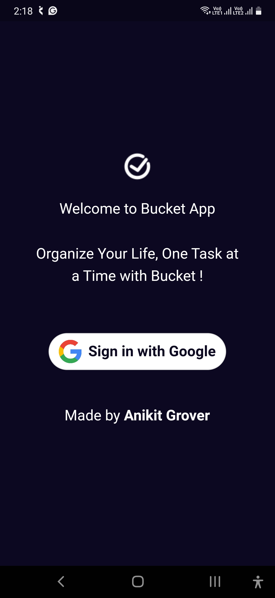
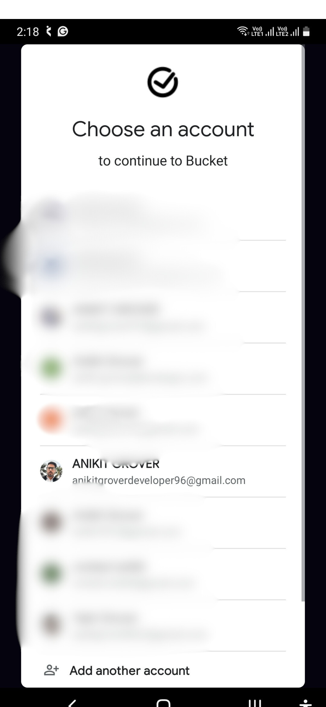
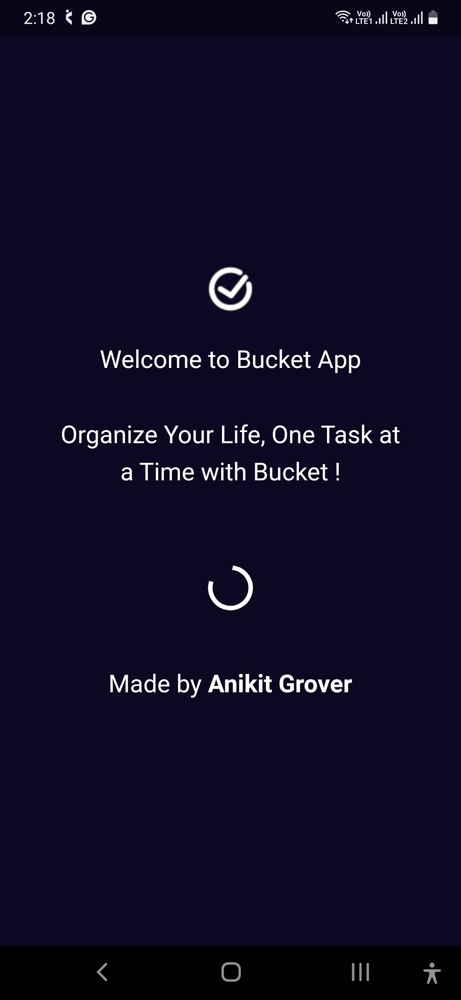
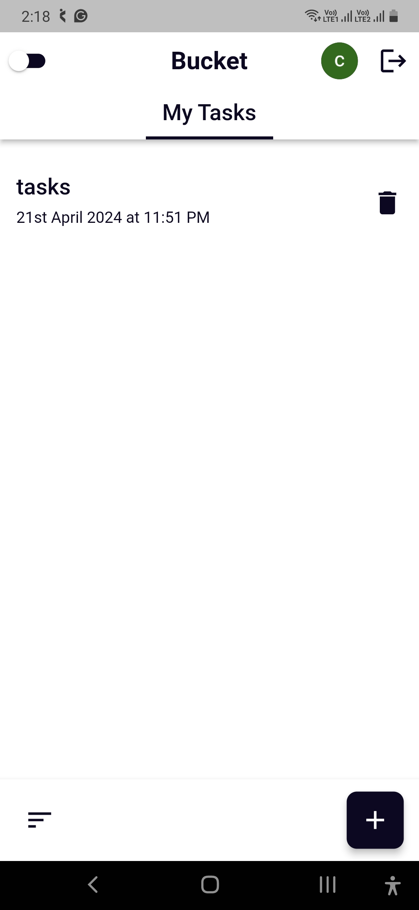
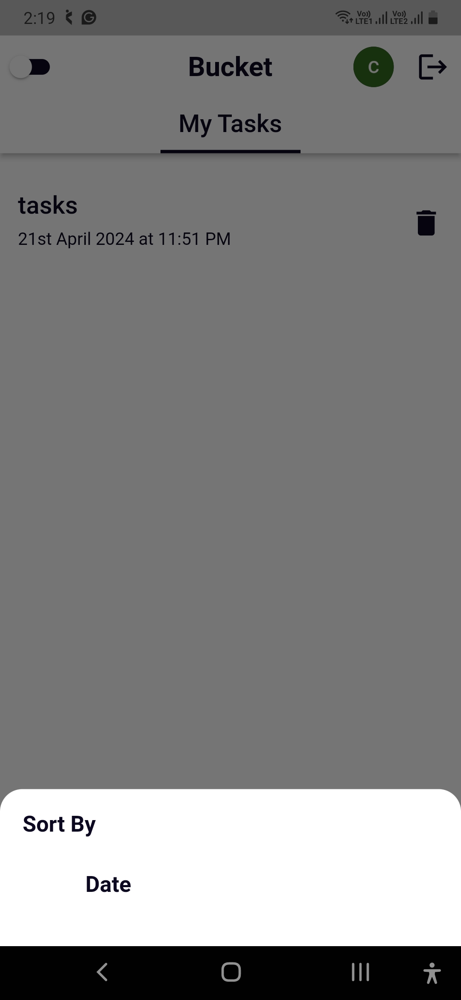
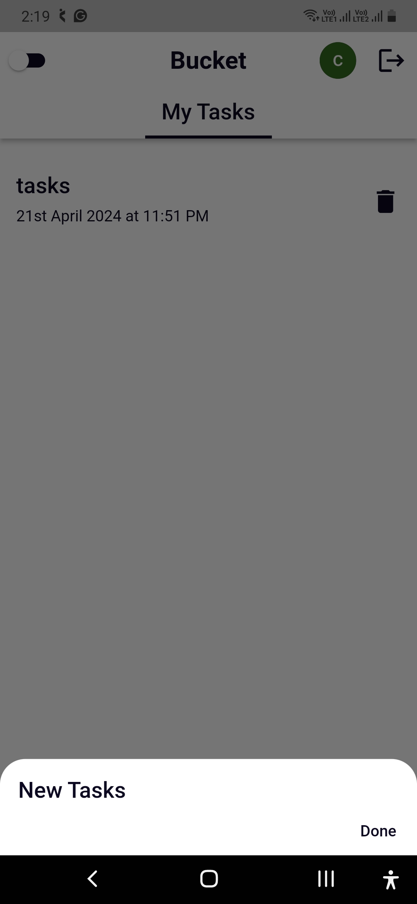
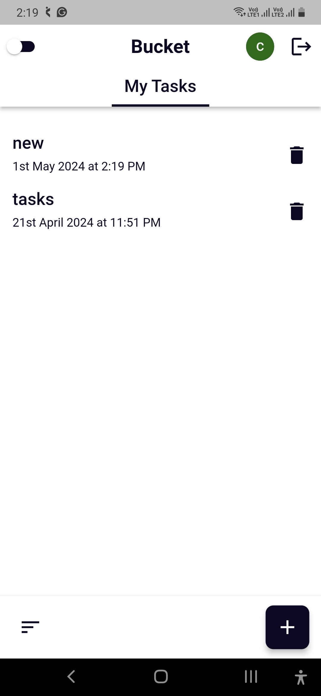
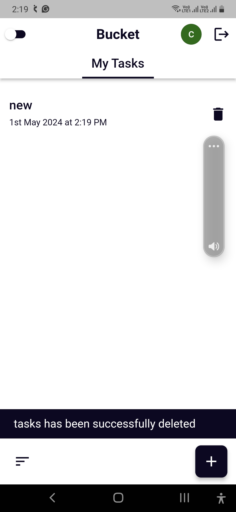
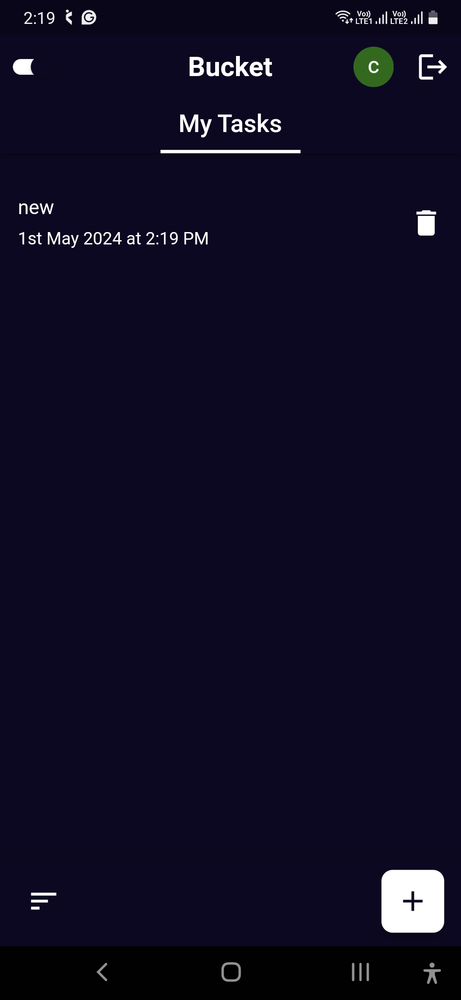

## 🎉 **Introducing Bucket** - A Flutter-Powered Todo App! 🎉

We’re thrilled to unveil **Bucket**, your new favorite Todo app crafted with Flutter and Firebase! 🚀📱✨

### 📝 **Stay Organized with Bucket** 📝

**Bucket** brings you a seamless way to manage your tasks with:

- **Secure Login:** Firebase Authentication with Google for a smooth and secure login experience.
- **Complete Task Management:** Effortlessly create, read, update, and delete tasks using Firebase Firestore.
- **Personalized Themes:** Switch between light and dark modes to match your style.
- **Smart Sorting:** Organize your tasks by date or name for better productivity.

### 📲 **Check It Out on Google Play:**
[Bucket App - Download Now](https://play.google.com/store/apps/details?id=com.bucketapp)

### 📸 **App Screenshots:**

### 👨‍💻 **Created & Maintained By:**

[Anikit Grover](https://github.com/AnikitDeveloper96)

### 🙌 **Show Your Support:**
- ⭐ [Recommend Me on LinkedIn](https://in.linkedin.com/in/anikit-grover) and endorse my skills.
- 🌟 Don’t forget to star ⭐ the repo – it’s free and appreciated!

### 💬 **Feedback and Contributions:**
Your feedback and contributions are invaluable! Feel free to reach out with suggestions or if you’d like to contribute to the project. Together, we can make task management a delightful experience!

Thank you for your support and enthusiasm! 🌍📲

---

Feel free to adjust any sections as needed!